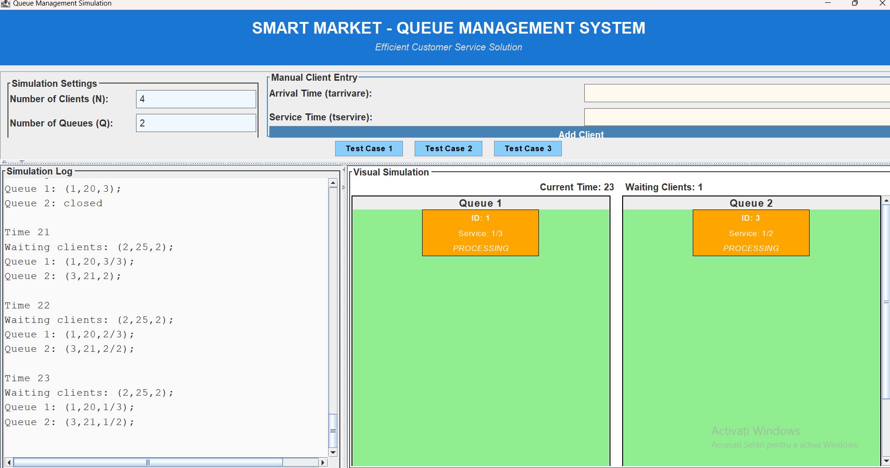
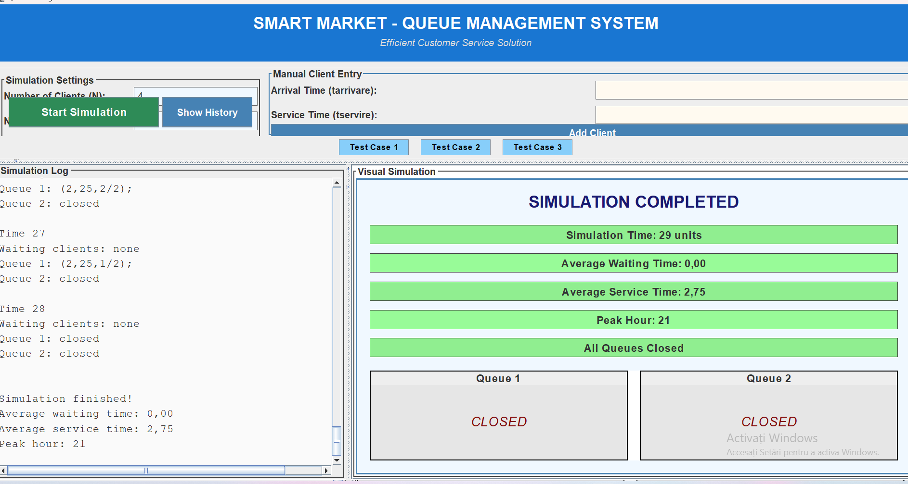
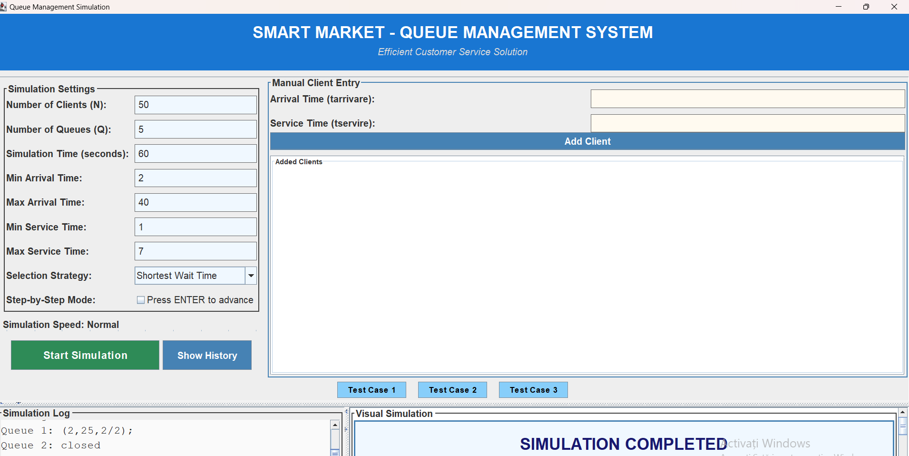
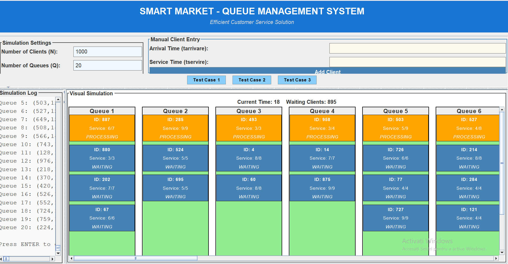

# Smart Market - Queue Management System

A Java-based desktop application that simulates a queue management system. It is designed to analyze and optimize customer service efficiency, offering real-time visual queue animations and detailed post-simulation statistics.

## Key Features

* **Configurable Simulation**: Set total clients (N), number of queues (Q), time limits, and arrival/service time intervals.
* **Dynamic Queue Animations**: Visual representation of clients moving through queues, updating in real-time with their current status ("WAITING", "PROCESSING") and remaining service time.
* **Dispatching Strategies**: Choose how clients are assigned to queues based on specific logic (e.g., "Shortest Wait Time", "Shortest Queue").
* **Execution Control**: Continuous run with adjustable simulation speed or manual progression via step-by-step mode. Includes manual client entry and predefined test cases.
* **Real-Time Logging & Final Statistics**: Live console log of queue states at every second, plus automated calculations for Average Waiting Time, Average Service Time, and Peak Hour upon completion.

## Technologies Used

* **Language**: Java
* **Graphical User Interface (GUI)**: Java Swing
* **Build Tool**: Maven

## Screenshots

### 1. Main Interface and Standard Simulation Run

### 2. Simulation Completion and Statistics Display

### 3. Detailed Parameter Configuration

### 4. Massive Scale Simulation and Real-time Queue Animations

